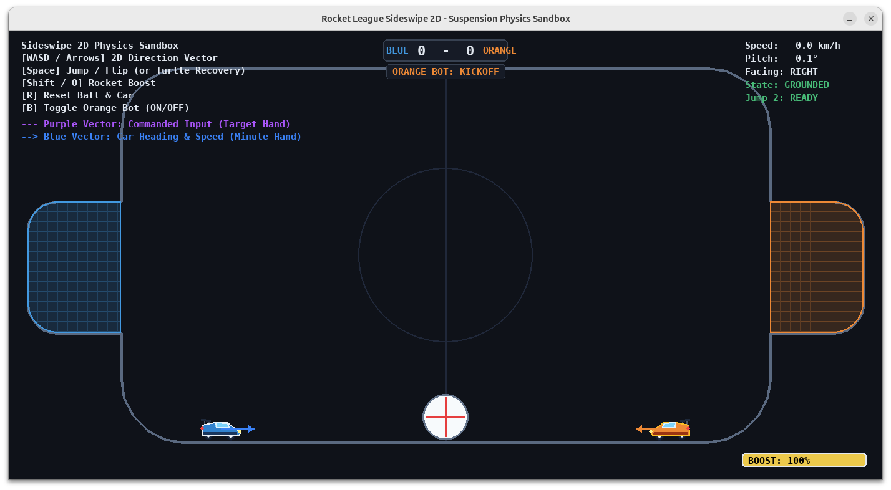

#### Autonomous Decision-Making Under Dynamic and Adversarial Constraints for 2D Soccer

_Project Proposal for Group 41_
_Benjamin Teh, Jensen Lu, Wee Fook Choon_

#### Motivation

Dynamic target interception and non-prehensile manipulation in multi-agent environments are fundamental challenges in
mobile robotics. These autonomous agents range from the low-velocity, high-inertia tugboats used for ship berthing [2]
to high-velocity, low-inertia unmanned aerial vehicles [4]. One less safety-critical application of these challenges is
robot soccer [1].

Inspired by the popular video game Rocket League, this project seeks to develop a policy for dynamic target interception
and non-prehensile manipulation in a multi-agent environment. Here, the agent must knock a ball into the opponent's goal
while simultaneously preventing the opponent from doing the same.

To simplify the problem, this project uses a 2D planar robot soccer framework. However, several key challenges are still
apparent from its 3D counterpart, namely, indirect manipulation of the ball, dynamic adversarial interaction, and
alternating dynamics between continuous motion and discontinuous impact. The simplified environment therefore serves as
a controlled testbed for studying several challenges shared with robotic systems: dynamic target interception,
non-prehensile object manipulation, contact-rich control, and sequential decision-making in the presence of another
autonomous agent.

#### Conventional Algorithms

A traditional approach for robot soccer is using finite state machines, where the robot switches between states such as
defending the goal, chasing the ball, and attempting a shot, depending on user-defined conditions based on sensor
information. This is a highly interpretable approach but is limited by the programmer's knowledge of possible situations
and is susceptible to omitted edge cases.

Within each state, the robot's actions can be determined using computationally efficient rule-based controllers or more
sophisticated planning and control approaches such as model predictive control (MPC). MPC optimizes actions over a
finite prediction horizon using a model of the system dynamics and an objective function. While these approaches enable
online planning, their computational requirements and design complexity can increase considerably when accounting for
continuous vehicle-ball interactions and the actions of an adversarial opponent.

Reinforcement learning (RL) provides an alternative by allowing the agent to learn its control policy through repeated
interaction with the environment. Through exploration, the agent will find optimal state-actions over a long horizon
which will then allow optimal actions to be selected during implementation with lower compute during runtime.

#### Problem Statements

The environment consists of a gravity-bound, side-view 2D enclosed arena containing an RL-controlled car, a
ball, and a scripted adversarial car. Two elevated goal regions are located on opposing sides of the arena. This poses 
as a continous state environment for the agent to explore. The agent must 
simultaneously control its vehicle to direct the ball into the opponent's goal and prevent the opponent from
scoring in its own goal. The elevated goals and non-uniform arena boundaries require the agent to learn complex
maneuvers such as dynamic positioning, aerial ball handling, and ball juggling, rather than simply pushing the ball
toward the opponent's goal along the ground, which would cause it to rebound from the wall beneath the elevated goal.

The opponent follows a finite state machine, creating a dynamic adversarial environment in which the agent must respond
to both ball dynamics and opponent behaviour. The learning objective is to discover a control policy capable of
combining low-level vehicle mechanics with high-level attacking and defensive behaviours.

#### RL Cast

State space: At each timestep, the agent observes the following:

- Kinematic state of itself and opponent: in terms of position, orientation, linear velocity, and angular velocity
- Kinematic state of ball: in terms of position, linear velocity, and angular velocity
- Relative direction and distance for the following relationships: agent-to-ball, opponent-to-ball, ball-to-opponent's goal, ball-to-own goal
- Other information: Availability of boost control, availability of second-jump, grounded/aerial state, and 8 normalized boundary raycasts separated by 45-degree intervals. These raycasts provide local awareness of the non-uniform arena boundaries without the need to directly encode the
static arena geometry.

Action space: A factored multi-discrete action space consisting of direction, jump, and boost provides 9 x 2 x 2 = 36
possible simultaneous action combinations. The directional component consists of eight directions at 45-degree intervals
and one neutral input, while jump and boost are binary on/off commands. A directional input combined with a second jump
while airborne triggers a directional dodge.

Reward structure: The primary reward is based on the outcome of the game. The agent receives a large positive reward
(e.g., +20) when it scores in the opponent's goal and a large negative reward (e.g., -20) when the opponent scores in
its own goal. Since goal-scoring events are relatively sparse, smaller intermediate rewards are provided based on the
ball's movement and position within the arena. Progress toward the opponent's goal is positively rewarded, while
movement toward the agent's own goal is penalized. The magnitude of these intermediate rewards is scaled according to
the ball's position, such that moving the ball toward its own goal becomes increasingly penalized as the ball approaches
it, while clearing the ball away from its own goal gets rewarded. The goal-scoring rewards are substantially larger than
the intermediate rewards so that scoring and preventing goals remain the agent's primary objectives.

#### RL Algorithm

Our problem has a continuous state space and a relatively small discrete action space, making both value-based and policy-based algorithms such as DQN and PPO applicable. We will use PPO as the primary algorithm because its stochastic policy provides natural exploration, while its actor-critic architecture is generally stable to train. For our factored action space, the actor will output separate probability distributions for direction, jump, and boost, while the critic estimates the expected return of the current state. Although PPO is less sample-efficient than off-policy methods, experience can be collected cheaply and in parallel within our simulation. The policy and value functions will be represented using an MLP actor-critic network. DQN will additionally be used as a comparison to investigate whether a policy-based formulation is more suitable for this task.

#### Experiment & Evaluation

Training will follow a curriculum of increasing opponent difficulty, beginning without an opponent so that the agent can learn basic movement, ball interaction, and scoring before progressively stronger scripted opponents are introduced. Opponent difficulty will be varied through behaviours such as jumping, boosting, and lookahead of future ball and vehicle states. Policies trained at different curriculum levels will be evaluated against multiple opponent difficulties using win rate, goals scored, goals conceded, and goal differential, with the results summarized in a comparison matrix to examine transfer across opponents. We will also compare PPO against DQN under the same conditions and compare the proposed shaped reward against a sparse-reward baseline containing only goal-scoring and goal-conceding rewards. Observation noise may additionally be introduced during evaluation to test robustness to imperfect state estimation.

#### References:

[1] Taourirte, Aya, and Md Sohag Mia. "Multi-Agent Reinforcement Learning and Real-Time Decision-Making in Robotic
Soccer for Virtual Environments." arXiv, 2025. DOI.org (Datacite), https://doi.org/10.48550/ARXIV.2512.03166.

[2] Oh, Jaejin, and Jongdae Jung. "Contact-Based Cooperative Tugboat-Assisted Ship Berthing Control via Physics-Informed
Reinforcement Learning." Ocean Engineering, vol. 363, Aug. 2026, p. 126675. DOI.org (Crossref),
https://doi.org/10.1016/j.oceaneng.2026.126675.

[3] T. M. Cao, H. A. Pham, M. Walter, V. Gies and T. Soriano, "Multi-Agent Robot Swarms: A Review of Sensing and
Perceptual Strategies for RoboCup Soccer," 2025 11th International Conference on Mechatronics and Robotics Engineering
(ICMRE), Lille, France, 2025, pp. 126-131, doi: 10.1109/ICMRE64970.2025.10976285.

[4] Brust, Matthias R., et al. "Swarm-Based Counter UAV Defense System." Discover Internet of Things, vol. 1, no. 1,
Dec. 2021, p. 2. DOI.org (Crossref), https://doi.org/10.1007/s43926-021-00002-x.

